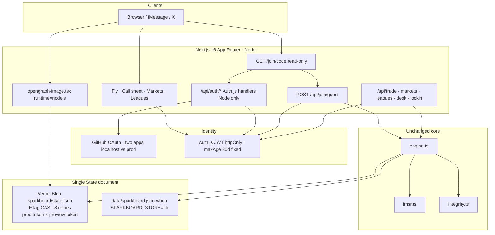
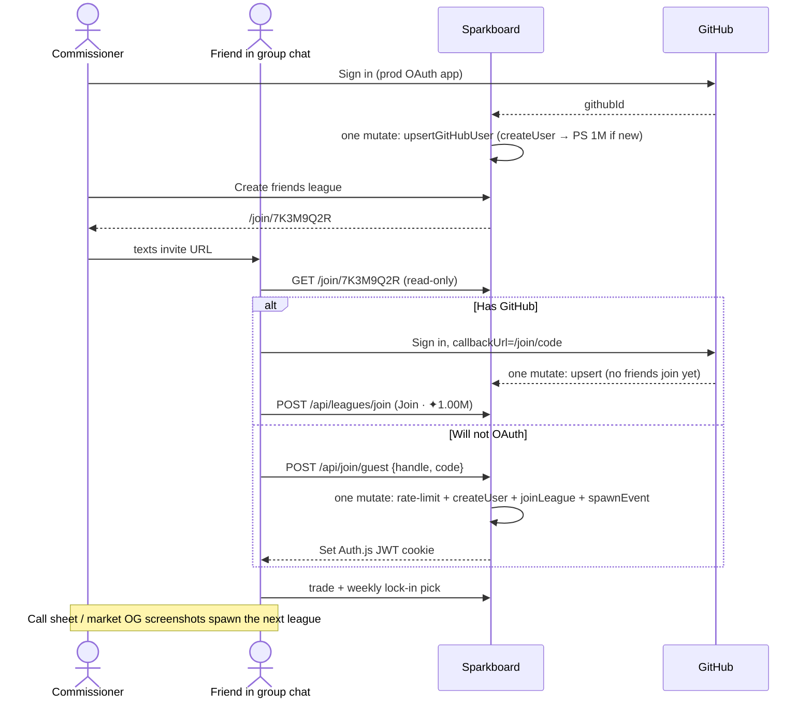
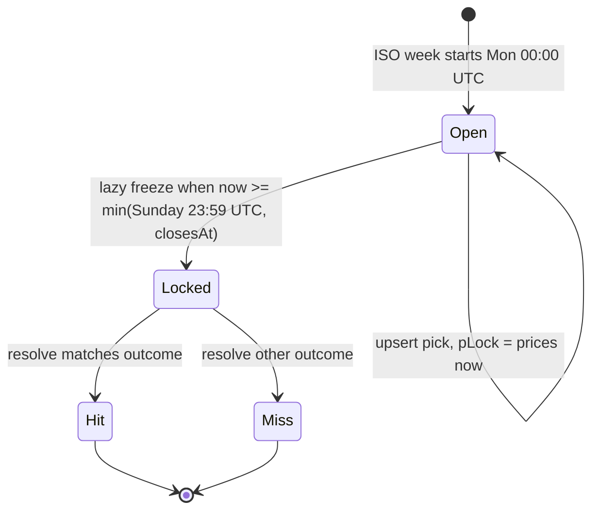
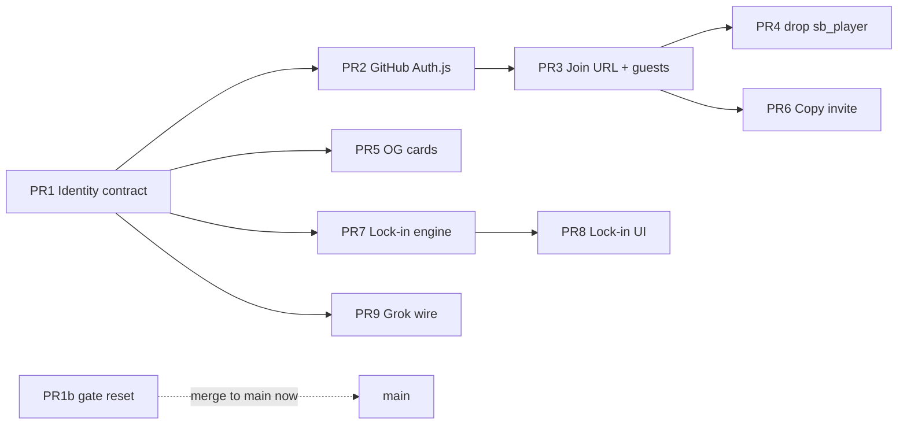

# Sparkboard Growth Loops — from spike to a sendable game

| Field | Value |
| --- | --- |
| Status | Draft (revised) |
| Author | TBD |
| Date | 2026-09-02 |
| Revised | 2026-09-02 |
| Product | Sparkboard (play-money prediction game) |
| Production | https://sparkboard-zeta.vercel.app |
| Repo | https://github.com/tjtags/sparkboard |
| Local | `/Users/tuliotagliaferri/projects/sparkboard` |
| Related | [`README.md`](../README.md), [`RESEARCH.md`](../RESEARCH.md), [`AGENTS.md`](../AGENTS.md) |
| Cutover | Stack PRs 1–3 on branch `growth`. Merge `growth` → `main` is the sendable moment. Do not land “kill Mira” on `main` before `/join` works. |

---

## Overview

Sparkboard is a play-money prediction game. The maker is Hanson’s LMSR (`src/lib/lmsr.ts`). The unit of account is Sparks (✦). Every desk gets 1,000,000 per league, sparks never leave a league, and there is no shop, wire, or cash-out. That is the gambling line, and it does not move in this phase.

The spike is live and the book works. It is not sendable. Identity is a dropdown (`PlayerBar`) over every desk in `State.users`. `POST /api/session` will mint you Mira’s cookie. `currentUser()` in `src/lib/views.ts` falls back to Mira when the cookie is missing, so unauthenticated form posts (create league, create market, resolve) run as her. Integrity (`src/lib/integrity.ts`) is load-bearing against farms, but a ranking is theatre if anyone can *be* the ranked desks.

This document sequences the product that actually grows: **fantasy football for the news**. The unit of growth is a **league**, not a download. One person opens a desk, texts an invite, everyone gets a fresh million in that league, they fight over the same questions, and the call sheet / fly is the public artifact people screenshot. Public Square is the showcase. Friend leagues are where people stay. We do not try to beat Manifold at global volume. We beat them at a group chat with a book.

Work is scoped in four layers, in this order:

1. **P0 — Identity + invites.** GitHub OAuth (Auth.js, Node handlers only, no Next.js `proxy.ts`) as the primary desk; `/join/[code]` as the growth URL; invite-gated guest handles via `POST /api/join/guest` (one `mutate`, then mint JWT). Production hides the switcher. After `growth` merges to `main`, the URL is sendable.
2. **P1 — Shareable objects.** Code-generated OG cards for markets (exact implied probabilities), one-tap copy invite, links that look like a forecast in iMessage/X.
3. **P2 — Lock-in cards.** Weekly picks per league, points not elimination, card score shown next to book PnL. `pLock` is the price at last upsert, lazily frozen.
4. **P3 — Daily desk.** Call sheet stays the morning habit. Grok drafts actually render on `/call-sheet` when `XAI_API_KEY` is set; otherwise the canned midterm wire. Suggest is an authenticated write.

LMSR does not change. Integrity gates do not go away because GitHub exists. The store stays a JSON document (`src/lib/store.ts`) — local file or Vercel Blob with ETag CAS. Postgres is out of scope below ~10k users.

**Cutover rule (one sentence, every section agrees):** PRs 1–3 stack on `growth` and deploy to a Vercel preview that uses a **separate Blob store**. Founder + one friend complete `/join/DESK12` there. Merge `growth` → `main` is production going sendable. PR 1b (gate `/api/reset`) may merge to `main` immediately; it does not kill Mira.

---

## Background & Motivation

### Current state

The spike already has the mechanism and the surface:

| Piece | Where it lives | Status |
| --- | --- | --- |
| LMSR maker, prior π, log-sum-exp | `src/lib/lmsr.ts` | Done. Do not touch except tests. |
| Engine: users, leagues, memberships, trades, resolve | `src/lib/engine.ts` | Done. Extend, don’t rewrite. |
| Integrity: unique traders, top-two volume, clusters, freeze at resolve | `src/lib/integrity.ts` | Done. Auth reduces sybil; it does not replace this. |
| Single `State` blob, file or Blob CAS (8 retries) | `src/lib/store.ts` | Done. Auth users go in the same document. |
| Seed: Mira/Cole/Anjali, Public Square, Desk 12 (`DESK12`), 2026 midterms | `src/lib/seed.ts` | Keep as flavor on the fly. Not selectable in prod. |
| Session cookie `sb_player` | `src/lib/session.ts`, `src/app/api/session/route.ts` | **Broken for sending.** |
| Desk switcher + public Spawn | `src/components/PlayerBar.tsx`, `src/components/Shell.tsx` | **The blocker.** Spawn is a faucet. |
| Call sheet + Grok stub | `src/app/call-sheet/page.tsx`, `src/app/api/desk/suggest/route.ts` | Stub logs Grok and always redirects. Unauthenticated write after P3 unless gated. |
| Market metadata | `src/app/layout.tsx` static OG `/mark.jpg` | No per-market card. |
| League join | `POST /api/leagues/join` with `leagueId` + invite field | Works, but not a shareable URL. Exact, case-sensitive match. |
| Reset nuke | `POST /api/reset` | Open. Gate in PR 1b before anyone else. |

`User` today (`src/lib/types.ts`):

```ts
export type User = {
  id: string;
  handle: string;
  displayName: string;
  desk: string;
  createdAt: string;
  system?: boolean;
};
```

There is no GitHub id, no guest-vs-seed distinction, no way to say “this cookie is this human.” `createUser()` sanitizes a handle, rejects collisions, and auto-joins Public Square at `STARTING_BANKROLL` (1,000,000). That function is the right primitive. It is currently reachable from an unauthenticated `POST /api/session` that also accepts a raw `{ userId }` and will set the cookie to Mira.

### Pain points that block growth

1. **The site cannot be texted.** Anyone who opens https://sparkboard-zeta.vercel.app can become Mira Chen, trade her book, resolve her markets, or spawn `botte2`. Friend-league social KYC is a joke if the invitee lands on a dropdown of the whole square.
2. **Unauthenticated writes impersonate Mira.** `actorId()` in `src/lib/http.ts` calls `currentUser()`, which does:

   ```ts
   return s.users.find((u) => u.handle === "mira") ?? s.users.find((u) => !u.system)!;
   ```

   `POST /api/leagues`, `POST /api/markets`, and `POST /api/resolve` therefore run as Mira when the cookie is absent. `POST /api/trade` is slightly stricter (401 without cookie) but still trusts the cookie value as a user id with `httpOnly: false`. `fail()` maps every `EngineError` to 400, so a future `need_desk` would come out as 400 unless we extend it.
3. **Invites are not a loop.** Desk 12’s code `DESK12` is printed on `/leagues` and `/leagues/[id]`. Join is a form that needs a league id *and* the code, and it uses whatever desk the switcher currently is. There is no `/join/DESK12` that creates a human and drops them in with a fresh million.
4. **Nothing screenshots as a forecast.** Market URLs unfurl the generic mark. The call sheet is the intended public artifact and it has no OG of its own.
5. **Grok is a no-op.** `src/app/api/desk/suggest/route.ts` calls `https://api.x.ai/v1` when `XAI_API_KEY` is set, `console.log`s the text, discards `FALLBACK`, and always `formRedirect`s to `/markets/new?topic=…`. The call sheet never lists suggested questions. After P3 it would also be an unauthenticated Blob write.
6. **The fantasy layer is missing.** RESEARCH.md explicitly deferred “survivor-pool lock-in cards.” Without a weekly card, a friend league is just a thinner Manifold. The thing that keeps a group chat coming back is a locked pick against the same questions.

### Why this is the product, not an add-on

Fantasy football does not grow by out-featuring DraftKings’ global contest. It grows because *your* league has a commissioner, an invite, a weekly card, and a board you argue about in the chat. Sparkboard’s equivalent:

1. One person opens a desk (GitHub, because the founder already lives there).
2. They text `/join/[code]`.
3. Friends who will not OAuth pick a handle (`POST /api/join/guest`). Everyone gets ✦1,000,000 in *that* league. No wire.
4. They trade the same books. They also lock one pick a week.
5. The fly / call sheet is what gets screenshotted into a different chat, which is how the next league starts.

Public Square is the storefront (seeded 2026 midterms, integrity-gated board). Friend leagues are the retention loop.

---

## Goals & Non-Goals

### Goals

- **Sendable production URL.** A stranger who receives the link cannot become Mira. Production has no player switcher and no Spawn box.
- **One human → one Public Square desk.** First GitHub upsert or guest spawn grants ✦1,000,000 in Public Square. GitHub id is the uniqueness key for OAuth desks.
- **League invite as the growth unit.** `GET /join/[code]` is **read-only** (lookup + CTA). `POST /api/leagues/join` (signed-in) or `POST /api/join/guest` (unsigned + handle) drops them in with a fresh ✦1,000,000 in that league.
- **Group-chat path.** Friends without GitHub pick a handle, bound to an httpOnly JWT, rate-limited, linkable to GitHub later from `PlayerBar`.
- **Shareable forecast cards.** Market links unfurl question + exact implied probability + Sparkboard mark. Invite links unfurl league name.
- **Weekly lock-in card per league.** Points, not elimination. Card hits/score sit next to book PnL, not inside it.
- **Call sheet as a daily habit.** Grok drafts list on `/call-sheet` when keyed; canned midterm wire otherwise. No third-party scraping. Suggest requires a desk.
- **Independently reviewable PRs** a single implementer can land. P0 stacks on `growth`; merge to `main` is the cutover.

### Non-Goals (this phase)

- Real money, deposits, withdrawals, redeemable points, a shop, or any conversion of Sparks. [`AGENTS.md`](../AGENTS.md) is explicit.
- Switching the maker to CPMM / Maniswap / LS-LMSR. LMSR stays in `src/lib/lmsr.ts`.
- Replacing integrity gates with proof-of-personhood. Auth is a sybil *reduction*.
- Postgres, Redis, or a Vercel KV. Argue in a follow-up if `State` JSON exceeds ~10 MB or CAS retries become user-visible.
- Combinatorial books, LMSR derivatives, options on `p_t`.
- X/Twitter OAuth (nice-to-have; not blocking).
- Survivor-pool elimination as the default card mode (league setting later).
- Scraping NYT / Cook / Ballotpedia. Seed + Grok only.
- Merging two desks’ bankrolls when a guest later links a GitHub that already has a desk.
- Email magic links, SMS, passkeys (guest handle + cookie is the lightweight path).
- Mobile apps. The sendable object is a URL.
- Next.js `proxy.ts` / `middleware.ts` for Auth.js (pulls `mutate` onto Edge).
- Better Auth this phase.
- Auth.js Credentials provider for guest mint (error model cannot return 429 `spawn_rate`).
- `AUTH_REDIRECT_PROXY_URL` funneling preview OAuth into the production Blob.
- Sliding session TTL (requires proxy). Fixed `maxAge` 30 days.

---

## Proposed Design

### Architecture after P0–P3



No `proxy.ts`. `auth()` is called from Node route handlers and Server Components only.

### Growth loop (the product)



---

### P0 — Identity + invites (sendable)

Lives on branch `growth` until the loop works on a preview with its own Blob. See [Rollout Plan](#rollout-plan).

#### 1. Kill impersonation

`currentUser()` today is a demo helper that *always* returns a desk. Replace with a function that may return `null`. **This is the one predicate.** Quote it from `src/lib/views.ts` in both this section and §2.

**Before** (`src/lib/views.ts`):

```ts
export function currentUser(s: State, userId: string | undefined) {
  if (userId) {
    const u = s.users.find((x) => x.id === userId && !x.system);
    if (u) return u;
  }
  return s.users.find((u) => u.handle === "mira") ?? s.users.find((u) => !u.system)!;
}
```

**After (canonical):**

```ts
import { devSwitcherEnabled } from "./session";

export function currentUser(s: State, userId: string | undefined): User | null {
  if (!userId) return null;
  const u = s.users.find((x) => x.id === userId);
  if (!u || u.system) return null; // never the oracle
  if (u.authKind === "seed" && !devSwitcherEnabled()) return null;
  return u;
}
```

Seed desks are accepted **only** when `devSwitcherEnabled()` is true. System is never accepted. Production therefore cannot impersonate Mira even if a stale JWT names `user_mira`.

`actorId()` (`src/lib/http.ts`) becomes `Promise<string | null>` and **must not** throw on `.id`. Unauthenticated writes return **401** `{ error: "Pick a desk first", code: "need_desk" }` via `fail()` (see [API / Interface Changes](#api--interface-changes)).

`POST /api/session` no longer accepts `{ userId }` except the impersonate route, and only when the switcher is on. The cookie becomes httpOnly, `Secure` on HTTPS, `SameSite=Lax`, `Path=/`. The existing `sb_player` cookie (`httpOnly: false`) is retired; Auth.js owns the session cookie.

`POST /api/trade` currently regex-parses the raw `Cookie` header. Switch it to `actorId()` / `fail()`. Do not trust a client-supplied `userId` in the JSON body.

**PR 1 also deletes the Spawn form** (`PlayerBar` handle input + `POST /api/session { handle }`). That faucet cannot wait for PR 3. After PR 1, the only way to mint a desk on `growth` is GitHub (PR 2) or `/join` (PR 3). Until those land, local DX is `SPARKBOARD_DEV_SWITCHER=1`.

#### 2. Dev switcher, opt-in only

Prompt requirement: production hides the switcher; dev *may* keep it behind `SPARKBOARD_DEV_SWITCHER=1`.

```ts
export function devSwitcherEnabled() {
  if (process.env.VERCEL_ENV === "production") return false;
  if (process.env.NODE_ENV === "production") return false;
  return process.env.SPARKBOARD_DEV_SWITCHER === "1";
}
```

`NODE_ENV === "production"` is also false-on-preview: Vercel preview builds set `NODE_ENV=production` and `VERCEL_ENV=preview`. **That is desired.** The switcher is a local `npm run dev` tool, not a preview toy. A preview that can impersonate Mira is not a sendable test.

When enabled, `PlayerBar` shows the seeded desks (Mira / Cole / Anjali / …) and `POST /api/session/impersonate` sets an Auth.js JWT (or a signed cookie) whose `sparkUserId` is a seed id. `currentUser` accepts it because `devSwitcherEnabled()` is true. Same predicate as §1.

Seed users stay in `buildSeed()` so the fly has tape; they are not a sign-in target in production or preview.

Local DX without GitHub: `SPARKBOARD_DEV_SWITCHER=1` **or**, after PR 3, `/join/DESK12` with a handle. GitHub OAuth on localhost uses the **localhost OAuth app** (see §3).

#### 3. Auth.js on this repo (Next.js 16)

Add **`next-auth@5.0.0-beta.32`** exactly (`package.json` pin, not `^` / `@beta`). Peer range includes `next@^16`. This release fail-closes `auth()` on config errors (GHSA-8fpg-xm3f-6cx3 / CVE-2026-73421). Smoke `/api/auth/providers` on a preview before merging `growth`.

JWT strategy, no database adapter, no Credentials provider, **no Next.js `proxy.ts` / `middleware.ts`**. Next.js 16 renamed middleware → proxy and requires a `proxy` export; Auth.js docs still show `export { auth as middleware }`. Importing `src/auth.ts` into that file pulls `mutate` → `fs` / `@vercel/blob` onto the Edge runtime and will fail the build or crash. We do not use it.

| Choice | Value |
| --- | --- |
| Package pin | `next-auth@5.0.0-beta.32` |
| Runtime for `handlers` and `jwt` callback | Node (`src/app/api/auth/[...nextauth]/route.ts`) |
| Proxy / middleware | **None.** Public read, authenticated write checked per route via `actorId()`. |
| Session TTL | `session.maxAge = 60 * 60 * 24 * 30` (30 days, **fixed** from issue). No sliding (sliding needs `auth()` in proxy). |
| Mutate on GitHub | Only when `account` is present (the callback), and only if `githubId` is not already mapped — `loadState` + skip write on returning users. |
| Better Auth | Not this phase. JWT-in-cookie + `State` users is the whole store story; Better Auth wants its own user table. |

Env:

| Env | Purpose |
| --- | --- |
| `AUTH_SECRET` | JWT signing. Required once auth is on. |
| `AUTH_GITHUB_ID` / `AUTH_GITHUB_SECRET` | **Production** GitHub OAuth app |
| `AUTH_GITHUB_ID_LOCAL` / `AUTH_GITHUB_SECRET_LOCAL` *or* a second `.env.local` | **Localhost** GitHub OAuth app |
| `AUTH_URL` / `AUTH_TRUST_HOST=true` | Vercel prod |
| `AUTH_GITHUB_ID` absent | GitHub button hidden; guest-via-invite still works |
| `AUTH_REDIRECT_PROXY_URL` | **Do not set** toward production from preview |

**Two GitHub OAuth apps**, not “multiple callbacks on one app” (GitHub OAuth Apps take **one** Authorization callback URL, no wildcard):

| App | Callback |
| --- | --- |
| Sparkboard local | `http://localhost:3000/api/auth/callback/github` |
| Sparkboard prod | `https://sparkboard-zeta.vercel.app/api/auth/callback/github` |

Do **not** use `AUTH_REDIRECT_PROXY_URL=https://sparkboard-zeta.vercel.app/api/auth` to share the prod app with previews. That would mint production desks from preview OAuth into whatever Blob the preview token points at — and if that token is still production’s (today’s README creates one store for production+preview+development), it writes prod `state.json`. Test GitHub on localhost and production. Test guests on a preview that has its **own** Blob (P0 ops prerequisite). If we ever need GitHub on preview, add a third OAuth app; do not proxy into prod.

GitHub scopes: **`read:user` only.** Do not request `user:email`. We do not persist email.

Files:

- `src/auth.ts` — `NextAuth({ providers, session: { strategy: "jwt", maxAge: 30d }, callbacks })`. No `mutate` import if we can keep upsert in the route-only jwt path; the jwt callback **does** run on the Node handler, so `mutate` is legal **there**, not in a proxy.
- `src/app/api/auth/[...nextauth]/route.ts` — `export const { GET, POST } = handlers` (Node).
- `src/lib/auth-users.ts` — `upsertGitHubUser`, `spawnGuest` (called from the guest route, not from Auth.js).

```ts
// src/auth.ts — jwt callback. mutate only on the GitHub callback, and skip write if mapped.
// NEVER throw github_taken out of this callback — Auth.js would dump to /api/auth/error
// and often drop the guest cookie. Catch, log, return the incoming token unchanged.
callbacks: {
  async jwt({ token, account, profile }) {
    if (account?.provider === "github" && profile) {
      const githubId = String(profile.id);
      const guestId =
        token.authKind === "guest" ? (token.sparkUserId as string | undefined) : undefined;

      const existing = (await loadState()).users.find((u) => u.githubId === githubId);
      if (existing && !guestId) {
        token.sparkUserId = existing.id;
        token.authKind = "github";
        return token; // returning user: no PUT
      }

      try {
        const user = await mutate((s) =>
          upsertGitHubUser(s, profile, { guestId }),
        );
        token.sparkUserId = user.id;
        token.authKind = "github";
      } catch (e) {
        if (e instanceof EngineError && e.code === "github_taken") {
          console.log("auth.link.github result=taken sparkUserId=", guestId);
          return token; // guest session unchanged — do not set sparkUserId to the GitHub desk
        }
        throw e;
      }
    }
    return token;
  },
  async session({ session, token }) {
    session.user.sparkUserId = token.sparkUserId as string;
    session.user.authKind = token.authKind as "github" | "guest";
    return session;
  },
}
```

`upsertGitHubUser(s, profile, { guestId?: string })` — all inside **one** `mutate` when we do write. The engine function **may throw** `github_taken`; the jwt callback **must catch it**.

1. If `s.users` has `githubId === profile.id`:
   - If `guestId` is set and that user is a different desk → throw `EngineError("github_taken", "This GitHub already has a desk. Sign out and use GitHub.")`. The jwt callback catches this and returns the guest token unchanged (do not swap the JWT to the GitHub desk).
   - Else return the existing GitHub user.
2. Else if `guestId` is set: load that user; refuse if missing, `system`, or `seed`; stamp `githubId` / `githubLogin` / `avatarUrl` (GitHub avatar URL, persisted on `User` — it is a string in the blob, that is fine), `authKind: "github"`, `linkedAt`. Return it.
3. Else `createUser(s, login, name, { authKind: "github" })` which joins Public Square at 1M, then stamp GitHub fields.

Handle from `profile.login`, sanitized with the existing `createUser` rules (`[a-z0-9_]{2,20}`). Collision: suffix `_` + 3 chars from the GitHub id.

Do not create a second Public Square membership. `joinLeague` already throws `already_in`. Returning GitHub logins must not PUT the whole document (CAS collision with in-flight trades). First sight is one mutate; `createUser` already joins Public Square, so that 1M is inside the same `fn`.

**Connect GitHub** is on signed-in `PlayerBar` when `authKind === "guest"`. It starts the GitHub provider with the existing guest JWT still in the cookie, so the jwt callback sees `token.authKind === "guest"` and passes `guestId`. `/signin` is for **unsigned** visitors only. Do not render a GitHub CTA on `/signin` that a guest cookie would silently consume — a guest hitting `/signin` is signed in and should be redirected to the fly, where PlayerBar has “Connect GitHub.”

Link CTA (never the generic Auth.js error page):

```ts
signIn("github", { redirectTo: `${returnTo}${returnTo.includes("?") ? "&" : "?"}github=taken` });
```

`returnTo` is `/` or `/join/[code]`. After OAuth:

| Landing | Session | UI |
| --- | --- | --- |
| `?github=taken` | still `authKind === "guest"` | Banner: “This GitHub already has a desk. Sign out and use GitHub.” Guest cookie intact. |
| `?github=taken` | now `authKind === "github"` | Link succeeded; ignore the query (or strip it). |
| `/api/auth/error` | anything | **Must not happen for `github_taken`.** jwt did not throw. |

Do **not** throw `github_taken` out of `callbacks.jwt`. Catch, log `auth.link.github result=taken`, **return the incoming guest `token` unchanged**. Tests in `auth-users.test.ts` cover a callback-shaped wrapper (`linkGitHubJwt(token, profile)`), not only the engine throw.

#### 4. Guest path (group chat)

Friends who will not OAuth: **invite code + handle**, minted by **`POST /api/join/guest`**, not an Auth.js Credentials `authorize`. Credentials maps thrown `EngineError("spawn_rate")` to `CredentialsSignin` (redirect/401), not `429 { code: "spawn_rate" }`, and reading `x-forwarded-for` inside `authorize` is a mess.

```
POST /api/join/guest
{ handle: string, code: string }
```

**One `mutate`:**

```ts
mutate((s) => {
  // 1. rate-limit spawnEvents for ipHash (throw spawn_rate)
  // 2. league = leagueByInvite(s, code)  (throw bad_invite)
  // 3. user = createUser(s, handle, handle, { authKind: "guest" })  // PS 1M inside
  // 4. joinLeague(s, user.id, league.id, league.inviteCode)         // friends 1M
  // 5. s.spawnEvents.push({ ipHash, at }); cap 2000
  return user;
});
```

Then mint an Auth.js **JWE** session cookie on the **same** `POST /api/join/guest` response so the next `auth()` sees the new desk. Auth.js session cookies are JWE, not compact JWS. `encode` from `next-auth/jwt` derives the encryption key with HKDF; **`salt` must equal the cookie name**. GitHub sessions are still minted only by Auth.js handlers, not this helper.

```ts
// src/lib/session-cookie.ts — used only by POST /api/join/guest
import { encode, decode } from "next-auth/jwt";

const MAX_AGE = 60 * 60 * 24 * 30;

export function sessionCookieName() {
  // Auth.js defaultCookies(useSecureCookies):
  // HTTPS production (and Vercel preview, NODE_ENV=production): __Secure-authjs.session-token
  // http localhost (`npm run dev`): authjs.session-token
  const useSecure = process.env.NODE_ENV === "production";
  return `${useSecure ? "__Secure-" : ""}authjs.session-token`;
}

export async function mintGuestSession(userId: string) {
  const secret = process.env.AUTH_SECRET;
  if (!secret) throw new Error("AUTH_SECRET is required to mint a guest session");
  const salt = sessionCookieName(); // MUST equal the cookie name
  const value = await encode({
    token: { sub: userId, sparkUserId: userId, authKind: "guest" },
    secret,
    salt,
    maxAge: MAX_AGE,
  });
  return {
    name: salt,
    value,
    options: {
      httpOnly: true,
      sameSite: "lax" as const,
      path: "/",
      secure: salt.startsWith("__Secure-"),
      maxAge: MAX_AGE,
    },
  };
}
```

On the guest route, after the mutate:

```ts
const cookie = await mintGuestSession(user.id);
const res = NextResponse.json({ userId: user.id, handle: user.handle }, { status: 201 });
res.cookies.set(cookie.name, cookie.value, cookie.options);
return res;
```

`iat` / `exp` come from `maxAge`; do not set them by hand. Do not hand-roll JWS. Unit-test: `encode` → `decode({ token, secret: AUTH_SECRET, salt: sessionCookieName() })` → `sparkUserId` round-trips. Map mutate errors through `fail()`: `spawn_rate` 429, `bad_invite` / `handle_taken` 400.

`createUser` already joins Public Square. `joinLeague` for the friends league is in the **same** `fn`, so a bad invite cannot leave a Public Square orphan from this route (we look up the league before create). If `createUser` throws `handle_taken` we never join. CAS retries re-run the whole `fn` against a fresh ETag, so handle uniqueness and the 3/hour slot stay serialized. Exhausted CAS still throws “Sparkboard store is busy; retry the ticket” — same string on login as on a trade; do not special-case it.

Rules:

- Guest spawn is **invite-gated**. There is no public “Spawn” box (removed in PR 1).
- Two isolated millions, same as today — sparks still cannot move between them.
- Clearing cookies abandons the desk. Acceptable: no transfers. Integrity still gates the board. Copy on `/join`: “this handle lives in this browser until you connect GitHub.”
- Later link: PlayerBar “Connect GitHub” as in §3. Refuse if `githubId` taken. Do not merge bankrolls.

Rate limit (inside the same `mutate`, last 2,000 `spawnEvents` retained):

| Key | Limit |
| --- | --- |
| SHA-256 of `x-forwarded-for` (or `unknown`) | 3 guests / hour, 20 / day |
| Handle | unique, existing `handle_taken` |
| Invite code | must match a friends league (`leagueByInvite`) |

This is not proof of personhood; it is “you cannot mint a farm from one phone in an afternoon.” Unique-trader / concentration / cluster rules still apply.

**Invariant:** guest spawn occupies exactly one `mutate`. First GitHub upsert occupies exactly one `mutate` (or zero if already mapped). Friends join for an already-signed-in GitHub desk is a **separate** user-initiated POST (`/api/leagues/join`), also one `mutate`, idempotent on `already_in`.

Test: two concurrent `spawnGuest` calls with the same handle against a fake CAS (second apply sees `handle_taken`). The loser gets 400 `handle_taken`, not a generic Auth.js error.

#### 5. `/join/[code]`

New App Router page. This is the URL that gets texted. **GET is read-only.** No `mutate` on GET, prefetch, refresh, back, or OG/metadata.

```
GET /join/DESK12
GET /join/7K3M9Q2R
```

Lookup: `leagueByInvite(s, code)`. Normalize = trim, uppercase, strip spaces and dashes. **The same `normalizeInvite(code)` runs inside `joinLeague` and `leagueByInvite`**, so a path segment `desk12` matches stored `DESK12`. If a caller still has the literal stored code (league object), pass that; do not require it. Unknown → 404.

Page copy, newsroom not casino: league name, blurb, member count, “You get ✦1,000,000 in {league}. Play-money. No cash-out. Not gambling.”

| Visitor | CTA |
| --- | --- |
| Signed in, not a member | Button: Join · ✦1.00M → **`POST /api/leagues/join`** with the code, redirect `/leagues/{id}` |
| Signed in, already a member | Redirect `/leagues/{id}` |
| Signed out, GitHub configured | “Sign in with GitHub” (`callbackUrl=/join/[code]`, then they still click Join) **and** handle form → `POST /api/join/guest` |
| Signed out, no GitHub env | Handle form only |

GitHub `callbackUrl` returns to `/join/[code]`. The server component **does not auto-join**. It shows “Join · ✦1.00M” if not a member. That POST is the friends-league 1M.

Signed-in join is cheap-rate-limited per `sparkUserId`: 10 failed invites per hour (probe). Persist that cap in `State.joinProbes` (same CAS as `spawnEvents` — a process-local counter is a no-op on Vercel cold isolates). 8-char Crockford is the real defense; this is belt. Overflow throws `EngineError("join_rate")` → 429. Inside the **same** `mutate` as `joinLeague`:

```ts
mutate((s) => {
  const hourAgo = Date.now() - 3600_000;
  const n = s.joinProbes.filter((p) => p.userId === userId && Date.parse(p.at) >= hourAgo).length;
  if (n >= 10) throw new EngineError("join_rate", "Too many invite tries. Wait an hour.");
  try {
    return joinLeague(s, userId, leagueId, code);
  } catch (e) {
    if (e instanceof EngineError && e.code === "bad_invite") {
      s.joinProbes.push({ userId, at: new Date().toISOString() });
      s.joinProbes = s.joinProbes.slice(-2000);
    }
    throw e;
  }
});
```

Upgrade invite codes: `createLeague` currently does `crypto.randomUUID().slice(0, 6).toUpperCase()` which is **hex**, ~16.8M space. New codes: 8 chars of Crockford base32 (no `I/L/O/U`), ~1.1×10^12 space, **retry on collision** with any existing `inviteCode` including seed `DESK12`. Keep `DESK12` in the seed so README still works.

Do not list invite codes on `/leagues` for visitors who are not members. Today the index prints `Invite DESK12` in the clear, which is fine for a spike and wrong for a sendable game — the commissioner shares `/join/DESK12`, the square does not.

#### 6. PlayerBar / Shell after auth

`src/components/Shell.tsx` today loads every non-system user into the switcher. After P0:

- Signed out: “Sign in” → `/signin` (GitHub + explanation that friends should use an invite link). **No Spawn form.** Cash hidden.
- Signed in, `authKind === "guest"`: `@{handle}` · ✦ cash · **Connect GitHub** (`signIn("github", { redirectTo: …?github=taken })`) · Sign out. If the URL has `github=taken` and the session is still guest, Shell shows the banner (not `/api/auth/error`).
- Signed in, `authKind === "github"`: `@{handle}` · ✦ cash · Sign out.
- Dev switcher dropdown: only if `devSwitcherEnabled()`. Never the Spawn input.

`/signin` is a small page, not a modal. Guest handle does not live here — guests arrive via `/join/[code]`. Public Square is GitHub-first; the faucet for people who will not OAuth is a friend who already has a league.

#### 7. Users stay in the State blob

JWT is database-less, so Auth.js does not need a session table. What *must* persist in `State`:

- `User` rows including `githubId` / `authKind` / `avatarUrl` (URL string)
- `Membership` rows (the 1M)
- `spawnEvents` for guest spawn rate limits
- `joinProbes` for signed-in invite probes (not an in-memory Map)

A second blob (`sparkboard/auth.json`) was considered and rejected: `joinLeague` + `createUser` already mutate the game document; splitting it creates a cross-document transaction we cannot CAS. Login volume is tiny next to trades. One document. Guest spawn and first GitHub upsert each occupy exactly one `mutate`; join is a separate idempotent `mutate`.

`State.version` bumps 1 → 2. See [Data Model Changes](#data-model-changes).

#### 8. Gate the reset nuke (PR 1b, merge to `main` now)

`POST /api/reset` (`src/app/api/reset/route.ts`) currently reseeds production for anyone who finds it. Require header `x-sparkboard-admin`. Fail closed if `SPARKBOARD_ADMIN_SECRET` is unset. Compare with `crypto.timingSafeEqual` on equal-length buffers; do not `===`. No UI. Log the event.

After an admin reset, existing JWTs still carry old `sparkUserId`. `currentUser` returns `null` (id not in the new seed, or seed rejected without the switcher). Users sign in again. Acceptable; mention in README. Do not try to preserve guest cookies across a reseed.

This PR does not kill Mira and does not belong on the `growth` gate. Ship it to `main` first.

#### 9. Preview Blob is a P0 ops prerequisite

README today creates one private Blob store for `production`, `preview`, and `development`. The cutover **depends** on clicking `/join/DESK12` on a preview. If that preview uses production `BLOB_READ_WRITE_TOKEN`, the click writes a real guest (and Public Square 1M) into prod `sparkboard/state.json`.

**Before merging `growth`:**

1. Create a second private Blob store for Preview (Vercel Storage, Preview environment only).
2. Confirm preview `GET /api/health` → `{ store: "blob" }` and that a throwaway mutate does not change production state.
3. Document in README: never click `/join` on a preview that shares prod state; preview token ≠ production token.
4. Local remains `SPARKBOARD_STORE=file`.

GitHub on preview is not required for the cutover smoke (guest path is the group-chat path). Do not set `AUTH_REDIRECT_PROXY_URL` at prod to make preview GitHub “work.”

---

### P1 — Shareable objects

Once the URL is sendable, the URL has to *look* like a forecast when pasted.

#### Market OG cards

Use Next.js `ImageResponse` / `opengraph-image`, **not** Imagine. Numbers must be the live LMSR price, formatted with the same `formatPct` as the fly (`src/lib/format.ts`).

```
src/app/markets/[id]/opengraph-image.tsx
src/app/markets/[id]/twitter-image.tsx   // re-export the same image
src/app/join/[code]/opengraph-image.tsx
src/app/call-sheet/opengraph-image.tsx
src/lib/og.ts                            // ogPct + layout helpers
```

Every image module:

```ts
export const runtime = "nodejs";
export const revalidate = 60;
```

Node is required because `loadState()` uses `fs` / `@vercel/blob`. iMessage (and many in-app browsers) **often ignore `revalidate`** and cache the first unfurl for a long time. 60s is still the right origin cache; do not promise iMessage will show a 60-second-fresh 62%. The fly is live; the card is a snapshot.

ImageResponse **cannot** use `next/font` CSS variables (`Newsreader` in `layout.tsx`). Fetch the font file in the image module (Google Fonts CSS → `src` URL → `fetch` → `ArrayBuffer`) and pass it as `fonts` to `ImageResponse`.

Helper, unit-tested:

```ts
// src/lib/og.ts — ranked by live LMSR price, not listing order
export function ogPct(m: {
  q: number[];
  b: number;
  pi: number[];
  outcomes: { name: string }[];
}) {
  const p = prices(m.q, m.b, m.pi);
  const ranked = m.outcomes
    .map((o, i) => {
      const pi = p[i] ?? 0;
      return { i, name: o.name, p: pi, big: formatPct(pi, 0), small: formatPct(pi, 1) };
    })
    .sort((a, b) => b.p - a.p);
  return { prices: p, ranked, leader: ranked[0], second: ranked[1] };
}
```

Fixture: `q = [0, 0]`, `π = normalize([0.62, 0.38])`, outcomes `[{ name: "Yes" }, { name: "No" }]` → `leader.big === "62%"`, `leader.small === "62.0%"`, `second.big === "38%"`. Same rounding as the fly `text-6xl` (`src/app/page.tsx` uses `formatPct(..., 0)`). A second fixture with `p[1] > p[0]` (70% “No”) must put No in `leader` so the image and the metadata title cannot disagree.

`createMarket` allows `n >= 2`. Layout and metadata both consume `ogPct` — **top two by current price**, never blindly `p[0]`.

Layout (1200×630), tokens from `src/app/globals.css` and the mark path from `src/components/Logo.tsx`:

- Background `#0B0E14`, copper radial, Newsreader (fetched) for the question.
- Sparkboard mark + wordmark top-left.
- Question, up to two lines, then `leader.name` + `leader.big` in `#E8B86D` tabular, large.
- `second.name` + `second.small` on the right.
- Footer kicker: `Play-money · not a forecast · sparkboard` plus integrity chip text (`Board-eligible · 6 desks` / `Thin · 2/5 desks`) so a screenshot does not launder a two-desk coin flip as a number.
- Never “odds”, “payout”, “bet”.

`generateMetadata` on `src/app/markets/[id]/page.tsx` uses `leader.big`, not listing order:

```
title: `${ogPct(market).leader.big} · ${market.question}`
description: "LMSR implied probability on Sparkboard. Play-money. No cash-out."
```

Root `src/app/layout.tsx` keeps the generic mark for routes without their own image.

**Join OG** (1200×630): league name (Newsreader), blurb one line, `✦1,000,000 · play-money · friends desk`, mark, same footer. No probability.

**Call-sheet OG:** “Politics call sheet” + the top row’s question and `ogPct(row).leader.big` + “Sparkboard desk” kicker. Same palette.

#### Invite copy

On `src/app/leagues/[id]/page.tsx`, members see a one-tap `CopyInviteButton` (client) that writes:

```
${origin}/join/${league.inviteCode}
```

`origin` from `headers().get("x-forwarded-host")` with proto, or `NEXT_PUBLIC_APP_URL` (set to `https://sparkboard-zeta.vercel.app` in production). `navigator.clipboard.writeText`. Visible fallback: the URL in a readonly field, not just the raw code.

Commissioner-only is unnecessary — any member can grow the league. That is the loop.

---

### P2 — Lock-in cards (fantasy layer)

This is what makes a friend league more than a private AMM.

#### Rules (v1)

- Each league has a weekly **card**: every member may pick **one** open `(market, outcome)` from the eligible pool.
- Week = **ISO week**, Monday 00:00:00.000 UTC → lock at **Sunday 23:59:59.999 UTC**, or `market.closesAt`, whichever is first. A pick on a market that closes Wednesday locks Wednesday.
- Picks are upsertable until lock, frozen after.
- One pick per `(leagueId, userId, isoWeek)`.
- **Reuse:** a user may not pick a `marketId` in that league while they have an **unsettled** pick on it (`open` or `locked`). After settle (`hit` / `miss` / `void`), that `marketId` is free for a later week **if the market is still open** (usually it is not — resolved books leave the pool). We do **not** let someone lock House every week while it is still open.
- **Week 7+ empty pool:** once every currently open non-meta book has an unsettled pick from that user, the form shows “No unused books — open a market.” The commissioner listing new questions is the refill. That is the desk loop, not recycling Collins.
- **Scoring: points, not elimination.** Misses stay in the chat. Survivor is `League.cardMode: "survivor"` later (non-goal).
- Card results are **not** sparks, **not** book PnL, **not** board-eligible integrity PnL. They are a second column. Do not put `SparkAmt` on the card column.

#### Eligible market pool

```ts
function cardEligible(s: State, league: League, m: Market): boolean {
  if (m.status !== "open") return false;
  if (m.category === "meta") return false;
  if (m.id === "mkt_coinflip") return false;
  if (league.cardPool === "league") return m.leagueId === league.id;
  return m.leagueId === league.id || m.leagueId === PUBLIC_LEAGUE_ID;
}
```

`mkt_coinflip` is an integrity demo and is not a card. Default:

```ts
cardPool: "league+public"  // friends default
cardPool: "league"         // Public Square: only its own books
```

Trading Public Square books still requires Public Square membership (every desk has it). Card picks do not move sparks.

#### pLock snapshot (no cron)

There is no weekly job in v1. **`pLock` is the LMSR price of the picked outcome at the last successful upsert**, stored on the row. It is **lazily frozen** when `now >= min(week.locksAt, market.closesAt)` on the next `setLockInPick` / `cardBoard` / `settlePicksForMarket`:

```ts
function maybeLock(pick: LockInPick, market: Market, now: Date) {
  if (pick.status !== "open") return;
  if (now.getTime() < pickLockAt(market, pick.isoWeek).getTime()) return;
  pick.status = "locked";
  // do not recompute pick.pLock from current q
}
```

If the user upserts Monday at 50% and never returns, Sunday’s 62% is **not** recovered. That equals Sunday’s print only if they confirmed at lock, or if a later weekly job is added (non-goal). Document this on the card UI: “Locked at {pLock} when you last confirmed.”

#### Status vocabulary (one)

Stored: `open` | `locked` | `hit` | `miss` | `void`.

| Stored | UI |
| --- | --- |
| `open` | editable pick |
| `locked` | “pending” (frozen, market unresolved) |
| `hit` / `miss` | settled |
| `void` | reserved; unused until we have cancel |

Do not store `"pending"`.



#### Scoring formula

At market resolve (`resolveMarket` in `engine.ts`), `settlePicksForMarket` runs **after** cash payouts, and **must not** touch `Membership.cash` or positions:

- `maybeLock` first (so a never-visited row still freezes at its last upsert `pLock`)
- `hit` iff `pick.outcomeId === market.resolvedOutcomeId`
- `points = hit ? 1 : 0`
- `edge = hit ? (1 - pLock) : -pLock`  // a 0.62 hit is **+0.38**, a miss is **−0.62**
- `cardScore += 100 * edge` (display as `+38.0` / `−62.0`)

We do **not** pay this in Sparks. Test: `pLock = 0.62` hit → points 1, edge +0.38, cardScore +38; miss → 0, −0.62, −62; `membership.cash` unchanged vs a control that skipped settle.

#### Engine

`src/lib/lockin.ts`, called from `engine.ts` on resolve:

- `isoWeekKey(d: Date): string` → `"2026-W36"`
- `weekWindow(key): { startsAt, locksAt }`
- `pickLockAt(market, week): Date` → `min(week.locksAt, market.closesAt)`
- `setLockInPick(s, userId, leagueId, marketId, outcomeId, now)`
- `settlePicksForMarket(s, market)`
- `cardBoard(s, leagueId): { user, hits, misses, pending, cardScore }[]` (`pending` = count of `locked`)

Reuse check: existing pick on `(leagueId, userId, marketId)` with `status === "open" || status === "locked"` → `EngineError("card_reuse", "You already used this book on a card")`. Settled (`hit`/`miss`/`void`) does not trip it.

Wrong league / not a member / market not in pool / not open / after lock → `not_in_league`, `closed`, `card_locked`, `card_pool`.

#### UI

On `src/app/leagues/[id]/page.tsx`, a band above the books:

- “Week 36 lock-in · locks Sunday 23:59 UTC” plus local-time equivalent
- If `open`: market `<select>` filtered to eligible + no unsettled reuse, outcome buttons, Submit. Show current implied % and, if a pick exists, last `pLock`
- If `locked`: frozen pick, `pLock`, “pending”
- League board table gains **Card** column: `3–1` hits–misses and signed **card score as a number, not `SparkAmt`**, next to existing `SparkAmt` book PnL

Public Square may run a card too (same engine). Ship the UI on friend leagues first.

No push notifications in v1. The reminder is the group chat and the league page.

---

### P3 — Daily desk

The call sheet (`src/app/call-sheet/page.tsx`) stays a paper-colored printout of `callSheet()` from `src/lib/views.ts` (markets with `callSheet: true`, sorted by `prices[0]`). That is the morning habit. P3 makes the wire real.

**Today** (`src/app/api/desk/suggest/route.ts`): if `XAI_API_KEY` is set, POST `https://api.x.ai/v1/chat/completions` model `grok-4.6`, log the content, ignore `FALLBACK`, redirect to `/markets/new?topic=…`. Unauthenticated.

**After:**

1. **`POST /api/desk/suggest` requires a desk.** `actorId()` null → 401 `need_desk`. Anyone cannot hammer Draft, burn CAS, or rotate the public sheet.
2. Parse Grok as JSON `{ questions: string[4] }`. Strip markdown fences if the model wraps them. Validate: 4 strings, each 12–140 chars, ends with `?`, no “bet/odds/payout/stake” wording (drop and log if it sneaks in).
3. Timeout 8s. On failure or missing key: use the existing `FALLBACK` four midterm questions.
4. Persist `WireDraft` in `State.wireDrafts` (keep last 5) inside one `mutate`.
5. Redirect **back to `/call-sheet`**, not `/markets/new`.
6. Call sheet renders a “Wire” list above the table: each question + “List this” → `/markets/new?question=…&topic=…`. Prefill from `searchParams`.
7. Unsigned **GET** `/call-sheet` still shows the last draft (or canned `FALLBACK` if none). Read is public; write is not.
8. Do not scrape NYT/Cook/Ballotpedia. Do not fetch arbitrary URLs the model suggests.

Prompt stays: “You draft play-money prediction-market questions. Return JSON `{questions: string[4]}`. Binary, resolvable, no gambling language.” Add: “US 2026 midterms / current news. Resolution must be a public official source. No personal identifiable targets, no markets on crime against named private persons.”

`XAI_API_KEY` absent → page still shows canned `FALLBACK` as the wire. The desk always has four suggested questions; Grok is how they refresh.

---

### Constraints that do not move

- Play-money forever in this phase. No shop. [`AGENTS.md`](../AGENTS.md).
- LMSR: prices on the simplex, complete-set cost = 1, max loss = `b ln n`, log-sum-exp. `npm test` before claiming the maker still works. **No PR in this plan changes LMSR numerics.**
- Integrity: unique traders (global 5, friends 3), top-two volume ≥ 90% ⇒ thin, opposing-cluster graph, `boardEligibleAtResolve` freeze. Auth is not a substitute.
- Caps: 8% of cash per ticket (`MAX_TRADE_CASH_FRAC`), 25% of starting million cost-basis per market (`MAX_MARKET_COST_FRAC`).
- Store: `SPARKBOARD_STORE=file` locally; production Blob `sparkboard/state.json`; **preview Blob is a different store**. Same `mutate()` for auth writes.
- Stack: Next.js 16 App Router, TypeScript, Tailwind v4, Vercel. Do not add a new runtime.

---

## API / Interface Changes

### `fail()` and `actorId()`

Today `fail()` maps every `EngineError` to **400**, and `actorId()` is `currentUser(…).id` (throws if we return null). Split across PRs because `auth()` does not exist until PR 2.

**PR 1** — cookie helper + new `currentUser` predicate. Do **not** import `auth()`:

```ts
export async function actorId(): Promise<string | null> {
  const s = await loadState();
  return currentUser(s, await readPlayerId())?.id ?? null;
}
```

**PR 2** — Auth.js session first. Read `sparkUserId`, not a truthy `auth` object (GHSA-8fpg-xm3f-6cx3 fail-closed):

```ts
export async function actorId(): Promise<string | null> {
  const s = await loadState();
  const id = (await auth())?.user?.sparkUserId ?? (await readPlayerId());
  return currentUser(s, id)?.id ?? null;
}
```

`fail()` status table (PR 1):

```ts
const STATUS: Record<string, number> = {
  need_desk: 401,
  spawn_rate: 429,
  join_rate: 429,
  forbidden: 403,
  github_taken: 409, // jwt path never uses fail(); listed so a future route cannot 400 it by accident
};

export function fail(e: unknown) {
  // keep NEXT_REDIRECT rethrow
  if (e instanceof EngineError) {
    const status = STATUS[e.code] ?? 400;
    return Response.json({ error: e.message, code: e.code }, { status });
  }
  throw e;
}
```

Every mutating route: `const userId = await actorId(); if (!userId) return fail(new EngineError("need_desk", "Pick a desk first"));` then `try/catch fail`. **Including** `POST /api/trade` and `POST /api/desk/suggest`. **PR 1 must add that one-liner** on the existing form routes that today do `const userId = await actorId()` and pass it straight into the engine (`src/app/api/leagues/route.ts`, `leagues/join/route.ts`, `markets/route.ts`, `resolve/route.ts`). Without it, `actorId()` null becomes `EngineError("no_user")` **400**, not 401 `need_desk`.

Admin reset (PR 1b) does not use `actorId`. It uses timing-safe header compare; missing/unset secret → 401.

### Session

| Method | Before | After |
| --- | --- | --- |
| `POST /api/session` `{ userId }` | Sets `sb_player` to any desk, `httpOnly: false` | **Gone in prod.** Dev-only `POST /api/session/impersonate` gated by `devSwitcherEnabled()` |
| `POST /api/session` `{ handle }` | `createUser` + cookie, public faucet | **Gone in PR 1.** Guests only via `POST /api/join/guest` |
| `GET/POST /api/auth/*` | n/a | Auth.js handlers, GitHub only, Node |
| `POST /api/join/guest` | n/a | One mutate + mint JWT. 201 / 400 / 429 |
| `POST /api/auth/signout` | n/a | Clears JWT |

### Actor

| Method | Before | After |
| --- | --- | --- |
| `POST /api/trade` | Cookie regex, 401 if missing | `actorId()` + `fail()`, 401 `need_desk` |
| `POST /api/leagues` | `actorId()` = Mira if unsigned | 401 if unsigned |
| `POST /api/leagues/join` | same | Signed-in user + invite; GET `/join` never writes; normalize inside `joinLeague`; 10 failed invites/hour/user in `State.joinProbes` → 429 `join_rate` |
| `POST /api/markets` | same | 401 if unsigned |
| `POST /api/resolve` | same | 401 if unsigned; still creator / member / system |
| `POST /api/reset` | Open nuke | PR 1b: `x-sparkboard-admin` + `timingSafeEqual`; fail closed |
| `POST /api/desk/suggest` | Unauth, logs Grok, redirects to new market | **401 `need_desk`**, persist `WireDraft`, redirect to `/call-sheet` |
| `POST /api/lockin` | n/a | `{ leagueId, marketId, outcomeId }` upsert pick |

### Routes (pages)

| Route | Role |
| --- | --- |
| `/signin` | Unsigned visitors, GitHub CTA. Guests already signed in redirect home. |
| `/join/[code]` | **The growth URL.** GET read-only. POST join or POST guest. |
| `/leagues/[id]` | Copy invite, lock-in card, board with card column |
| `/markets/[id]` | `generateMetadata` + `opengraph-image` |
| `/call-sheet` | Wire drafts + existing printout (GET public) |

No proxy wall on the fly. Public read, authenticated write.

---

## Data Model Changes

`State.version: 1` → `2`. Single document, same CAS.

```ts
export type AuthKind = "github" | "guest" | "seed" | "system";

export type User = {
  id: string;
  handle: string;
  displayName: string;
  desk: string;
  createdAt: string;
  system?: boolean;          // keep: oracle short-circuit in applyTrade
  authKind: AuthKind;        // NEW
  githubId?: string;         // NEW, unique
  githubLogin?: string;      // NEW
  avatarUrl?: string;        // NEW, GitHub avatar URL persisted on User (small string in the blob)
  linkedAt?: string;         // NEW, guest → GitHub
};

export type League = {
  // existing fields...
  inviteCode?: string;
  cardMode?: "points" | "survivor";   // default "points"; survivor unused in v1
  cardPool?: "league" | "league+public"; // friends default league+public
};

export type LockInPick = {
  id: string;
  leagueId: string;
  userId: string;
  isoWeek: string;            // "2026-W36"
  marketId: string;
  outcomeId: string;
  pLock: number;              // LMSR price of outcomeId at last upsert; lazily frozen
  lockedAt: string;           // last upsert time (not Sunday’s clock unless they confirmed then)
  status: "open" | "locked" | "hit" | "miss" | "void";
  points: number;             // 0 until settle; then 0 or 1
  edge: number;               // 0 until settle; then (hit ? 1 - pLock : -pLock)
  resolvedAt?: string;
};

export type WireDraft = {
  id: string;
  topic: string;
  questions: string[];
  source: "grok" | "canned";
  model?: string;             // "grok-4.6"
  createdAt: string;
};

export type SpawnEvent = {
  ipHash: string;             // sha256, hex
  at: string;
};

export type JoinProbe = {
  userId: string;
  at: string;
};

export type State = {
  version: 2;
  users: User[];
  leagues: League[];
  memberships: Membership[];
  markets: Market[];
  positions: Position[];
  trades: Trade[];
  lockInPicks: LockInPick[];  // NEW
  wireDrafts: WireDraft[];    // NEW, cap 5
  spawnEvents: SpawnEvent[];  // NEW, cap 2000
  joinProbes: JoinProbe[];    // NEW, cap 2000; signed-in bad-invite probes
  updatedAt: string;
};
```

`createUser` grows an options bag so v2 tests typecheck:

```ts
export function createUser(
  s: State,
  handle: string,
  displayName?: string,
  opts?: { authKind?: AuthKind },
): User {
  // ...existing sanitize / handle_taken...
  const user: User = {
    id: nid("user"),
    handle: h,
    displayName: (displayName || handle).trim().slice(0, 40),
    desk: "Independent",
    createdAt: now(),
    authKind: opts?.authKind ?? "guest",
  };
  s.users.push(user);
  joinLeague(s, user.id, PUBLIC_LEAGUE_ID);
  return user;
}
```

`engine.test.ts` “new desks” and any raw `User` literals in tests must set `authKind`. Seed helper `user(...)` stamps `seed` / `system`.

### Migration

Always fill missing arrays, even if `version >= 2` (a v2 doc written by a partial deploy may omit keys):

```ts
function migrate(s: State): State {
  const version = s.version ?? 1;
  if (version < 2) {
    for (const u of s.users) {
      if (u.system) u.authKind = "system";
      else u.authKind ??= "seed";
    }
    for (const l of s.leagues) {
      l.cardMode ??= "points";
      l.cardPool ??= l.kind === "friends" ? "league+public" : "league";
    }
    s.version = 2;
  }
  s.lockInPicks ??= [];
  s.wireDrafts ??= [];
  s.spawnEvents ??= [];
  s.joinProbes ??= [];
  return s;
}
```

Write-back happens on the next `mutate`. Seed rebuild (admin-gated reset) emits v2 directly. Seed users stay `authKind: "seed"` so production `currentUser` will not adopt them.

No dual-write, no backfill of GitHub ids (there are none). Guest desks created after cutover never collide with seed ids (`nid("user")` vs `user_mira`).

### Size / load

| Horizon | Users | Trades | JSON (order-of-mag) | Verdict |
| --- | --- | --- | --- | --- |
| Now (seed) | 9 | ~25 | ~40 KB | Fine |
| First 50 friend leagues × 8 | ~400 | ~5k | < 2 MB | Fine |
| 10k users, 100k trades, 20 weeks of cards | — | — | tens of MB | Revisit; `JSON.parse` + full PUT on every trade is the ceiling, not Blob’s 5 TB |

Vercel Blob CAS (8 retries, 40ms × attempt in `mutateBlob`) is the contention point, not disk. Auth writes are rare **if returning GitHub logins skip PUT**. Lock-in picks are one extra `mutate` per member per week. Stay on one blob per environment.

---

## Alternatives Considered

### 1. Identity

| Option | Pros | Cons | Decision |
| --- | --- | --- | --- |
| **A. Auth.js JWT + GitHub, Node handlers only, guest via `POST /api/join/guest`** | Founder already on GitHub/Vercel; one session cookie; no session table; 429 maps correctly | Another dependency; two OAuth apps | **Choose.** Pin `next-auth@5.0.0-beta.32`. No proxy. |
| B. Custom signed `sb_player` + GitHub token exchange, no Auth.js | Fewer deps | We would reimplement CSRF, callback, rotation, `Secure` cookie flags; easy to get `httpOnly` wrong again (today it is already wrong) | Reject as the GitHub path; guest POST uses Auth.js `encode`/`decode` (JWE, salt = cookie name), not a hand-rolled JWS |
| C. Clerk / WorkOS / Auth0 | Hosted UI, MFA | Third-party identity vendor for a play-money game; paid; not OSS-shaped | Reject |
| D. GitHub-only, no guests | Cleaner uniqueness | Kills the group-chat path | Reject as exclusive |
| E. Anonymous cookie desks, no OAuth | Fastest | Current spike. Not sendable. Farms | Reject |
| F. Auth.js Credentials `id: "guest"` | One `signIn()` API | `authorize` cannot return 429 `spawn_rate`; CSRF/`x-forwarded-for` inside Credentials is worse | Reject |
| G. Better Auth | Auth.js docs now point new projects here; Edge-friendlier | Wants its own user table; we already chose JWT-in-cookie + `State` users; this phase is “make the spike sendable,” not a second auth rewrite | **Reject this phase.** Revisit if Auth.js v5 + Next 16 proxy story stays broken after the pin |

X/Twitter OAuth is alternative-A-plus, not a substitute. Add a provider later; do not block P0.

### 2. Guest uniqueness

| Option | Pros | Cons | Decision |
| --- | --- | --- | --- |
| **Invite-gated guests + IP rate limit** | Social KYC matches friend leagues; matches RESEARCH.md | Multi-account via multiple invites/IPs | **Choose.** Integrity still gates the board |
| Proof of personhood (World, etc.) | Stronger | Out of product scope, creepy for a group chat | Reject |
| Phone / email OTP | Recoverable desks | SMS cost, ToS, PII we do not want to hold | Reject this phase |

### 3. Store for users/sessions

| Option | Pros | Cons | Decision |
| --- | --- | --- | --- |
| **Users in the existing State blob, JWT stateless** | One CAS, `createUser` already lives here, <10k is fine | Full-document PUT | **Choose** |
| Second blob `sparkboard/auth.json` | Smaller trade document | No cross-blob transaction; join would race | Reject |
| Postgres (Neon/Vercel) | Real queries, partial updates | New ops surface, migrations, splits the source of truth from LMSR state. Unjustified at current load | Reject until State is ~10 MB or CAS retries are user-visible |
| Auth.js Drizzle adapter | Familiar | Requires Postgres | Reject with Postgres |
| One Blob shared by prod + preview | Simple README | Preview `/join` writes prod desks | **Reject.** Separate preview store is P0 ops |

### 4. Lock-in scoring

| Option | Pros | Cons | Decision |
| --- | --- | --- | --- |
| **Points + card edge vs last-upsert pLock, stay in the chat on a miss** | Retention; no spark movement; no cron | pLock is not Sunday’s print unless they confirmed | **Choose for v1** |
| Snapshot pLock with a Sunday cron | True lock-time price | No job in v1; Vercel cron is a sequel | Later |
| Survivor: miss and you are out | Classic pool | Empty leagues by week 6 | League setting later |
| Pay card in Sparks | One numeraire | Crosses the gambling line; mixes with book PnL | Reject |
| Brier against the full vector | Cleaner math | Worse to explain in a group chat | Reject for v1 |
| Re-pick still-open House every week | Never empty | The card is not a forecast then | Reject |
| **Reuse after settle + commissioner lists** | Uniqueness is unsettled-only; week 7 refill is new books | Midterms stay burned until Nov | **Choose** |

### 5. OG images

| Option | Pros | Cons | Decision |
| --- | --- | --- | --- |
| **Next.js `opengraph-image` + `ImageResponse`** | Exact `formatPct`; no model; cacheable | Node runtime because of Blob; iMessage caches hard | **Choose** |
| Imagine / Grok image | Pretty | Numbers will be wrong. Explicitly forbidden | Reject |
| Static `/mark.jpg` (today) | Cheap | Does not look like a forecast in iMessage | Replace per-route |

### 6. Market pool for cards

| Option | Pros | Cons | Decision |
| --- | --- | --- | --- |
| **Friends default `league+public`, exclude `meta` / `mkt_coinflip`** | Midterm card works on day one without cloning books | ~6 books until commissioner lists more | **Choose** |
| League-only | Clean isolation | Desk 12 has one culture market; the card is empty | Reject as default |
| Clone Public Square markets into each friends league | True isolation of q/b | Divergent prices, subsidy multiplied, not “the same questions” | Reject |

### 7. Cutover mechanism

| Option | Pros | Cons | Decision |
| --- | --- | --- | --- |
| **`growth` branch; merge to `main` is sendable** | One story; production keeps Mira until `/join` works | Preview Blob must be split first | **Choose** |
| `SPARKBOARD_REQUIRE_DESK=1` on main | Independently merge PR 1 | Two stories, easy to ship PR 1 without the flag, 401s prod | Reject |
| Land PR 1 on main “behind session present” | Sounds safe | There is no such flag in the first draft; Vercel deploys `main` | Reject |

---

## Key Decisions

1. **Auth.js JWT + GitHub is the primary desk, Node handlers only.** Pin `next-auth@5.0.0-beta.32`. No database adapter. No `proxy.ts`. Mapping `githubId` → `User.id` in `State` is enough uniqueness for Public Square. Mutate only on first GitHub sight (`if (account)` and unmapped); returning logins `loadState` and skip PUT.

2. **Guests exist only through `/join/[code]` via `POST /api/join/guest`.** Public Spawn is deleted in PR 1. Not an Auth.js Credentials provider. One `mutate` (rate-limit + `createUser` + `joinLeague` + `spawnEvent`), then mint an Auth.js **JWE** with `encode` from `next-auth/jwt`: `salt` equals the cookie name (`__Secure-authjs.session-token` on HTTPS production, `authjs.session-token` on http localhost), same `AUTH_SECRET`, `maxAge` 30d, set on the POST response so `auth()` sees the desk. Connect GitHub lives on signed-in `PlayerBar` and passes `guestId` into `upsertGitHubUser`. `github_taken` is caught in the jwt callback; the guest token is returned unchanged; UI copy is `?github=taken` on the callbackUrl — never `/api/auth/error`.

3. **Unsigned is unsigned.** `currentUser()` returns `null`. Mira is not a default actor. Seed is accepted only when `devSwitcherEnabled()`. System is never accepted.

4. **Production never shows the switcher.** `SPARKBOARD_DEV_SWITCHER=1` is opt-in and forced off when `VERCEL_ENV === "production"` **or** `NODE_ENV === "production"` (so Vercel preview cannot impersonate either). Seed desks remain on the tape as `authKind: "seed"`.

5. **One State blob per environment, version 2.** Users, GitHub ids, lock-in picks, wire drafts, spawn events all live in `sparkboard/state.json` (or `data/sparkboard.json`). JWT holds `sparkUserId` so reads do not mutate. Postgres is not justified below tens of MB.

6. **Do not merge guest and GitHub desks.** Linking is attach-if-free, refuse-if-taken, keep the guest session. Merging millions is a gift and a farm. A guest who clicks `/signin` GitHub must not silently `createUser` a second desk.

7. **Invite codes become 8-char Crockford with a collision retry; `/join/[code]` is the share URL; GET is read-only.** `normalizeInvite` lives inside `joinLeague` and `leagueByInvite`. Stop printing raw codes on the public leagues index. Keep seed `DESK12`.

8. **Lock-in is points + edge vs last-upsert `pLock`, never Sparks, never survivor-by-default.** Lazy freeze; no cron. Card column is separate from `boardPnL()` and is not `SparkAmt`. Friend leagues default `cardPool: "league+public"`, excluding `meta` / `mkt_coinflip`. Reuse is unsettled-only; week 7 refill is the commissioner listing books.

9. **OG cards are `ImageResponse` with live LMSR prices, `runtime = "nodejs"`, `revalidate = 60`.** `ogPct` returns outcomes **ranked by current price** (`leader` / `second`); layout and `generateMetadata` both use `leader.big`. Fetch Newsreader; do not use `next/font` in the image module. Imagine is forbidden. iMessage may ignore revalidate.

10. **Grok drafts persist and render on `/call-sheet`.** Missing key ⇒ canned `FALLBACK`. No third-party scrapes. Redirect stays on the sheet. **`POST /api/desk/suggest` requires a desk.**

11. **Integrity stays.** GitHub reduces sock puppets; it does not retire unique-trader, top-two volume, cluster, or freeze-at-resolve.

12. **Play-money line does not move.** No shop, no cash-out, no redeemable card points. Card score is a number on a board, like fantasy football points.

13. **Cutover is merge of `growth` → `main`, not a flag.** Stack PRs 1–3 on `growth`. Preview uses a separate Blob. Founder + one friend complete `/join/DESK12` there. Then merge. Do not land “kill Mira” on `main` before `/join` works. PR 1b (reset gate) may merge to `main` immediately.

14. **`POST /api/reset` is admin-secret gated with `timingSafeEqual`, fail closed.** A sendable site cannot have a public reseed. After reset, stale JWTs resolve to `currentUser === null`.

15. **`pLock` is price at last upsert, lazily frozen.** We do not have Sunday’s `q` without a job. UI tells the truth.

16. **Guest mint is a dedicated POST, not Credentials `authorize`.** Error codes stay HTTP. Session is Auth.js JWE via `encode`/`decode`; salt = cookie name; `__Secure-` only on HTTPS production.

17. **No Auth.js proxy.** TTL is fixed 30 days. Two GitHub OAuth apps (localhost vs prod). Do not set `AUTH_REDIRECT_PROXY_URL` at production to serve previews.

18. **Better Auth is not this phase.** We already chose JWT-in-cookie + `State` users. Do not add a second user table to make the spike sendable.

19. **`fail()` status table:** `need_desk` 401, `spawn_rate` / `join_rate` 429, `forbidden` 403, `github_taken` 409, else 400. PR 1 `actorId` uses `readPlayerId()` only; PR 2 adds `auth()?.user?.sparkUserId`. Same helper on `/api/trade`. Form routes 401-branch in PR 1.

20. **Separate preview Blob is P0 ops, not an open question.** Never click `/join` on a preview that shares prod state.

---

## Security & Privacy Considerations

### Threat model (play-money, but the ranking is the prize)

| Threat | Severity | Mitigation |
| --- | --- | --- |
| Impersonate Mira / any desk via switcher or `sb_player` | **Critical** (today: real) | Remove `{ userId }` session setter; httpOnly JWT; `currentUser` null; seed only if switcher; Spawn deleted in PR 1 |
| Sybil farm via guest handles | High | Invite-gated spawn, IP hash rate limit, existing integrity gates, no transfers |
| Invite brute force (6 hex chars) | Medium | 8-char Crockford + collision retry; no public code listing; 10 failed invites/hour/user in `State.joinProbes` (429 `join_rate`) |
| Cookie theft (XSS) | Medium | httpOnly + Secure + SameSite=Lax; no transfers so theft is “play as them,” not “drain to me.” Guest desks are unrecoverable if cookie is cleared — acceptable |
| Guest later links a farmed GitHub | Medium | Refuse if `githubId` already used; keep guest session; no bankroll merge |
| Guest clicks `/signin` GitHub and mints a second desk | High if unfixed | `/signin` is unsigned-only; Connect GitHub on PlayerBar passes `guestId` |
| Open `POST /api/reset` | High (today: real) | PR 1b, timing-safe, fail closed |
| CSRF on trade/join | Medium | SameSite=Lax JWT; Auth.js CSRF on OAuth; keep POSTs; GET `/join` does not write |
| Unauthenticated Grok / `WireDraft` mutate | Medium after P3 | 401 `need_desk` on `POST /api/desk/suggest` |
| Grok prompt injection via topic field | Low | Topic length cap (80 chars), output schema validate, gambling-language filter, no tool/browse |
| OG card as a “forecast product” claim | Legal/reputational | Footer “play-money · not a forecast”; no gambling words |
| PII | Low | GitHub login + avatar URL only; IP hashed before `spawnEvents`; **no email scope, no email stored** |
| Preview OAuth/write into prod Blob | High if unfixed | Separate preview store; no `AUTH_REDIRECT_PROXY_URL` at prod |
| Resolve griefing | Medium (pre-existing) | Still creator / member / system. Auth does not make this worse. Follow-up: restrict resolve to creator + `user_desk` |

Auth reduces the “mint 50 desks from the Spawn box” attack. It does **not** stop two humans (or one human with two GitHubs) from opposing each other. That is what `findClusters` / `THIN_TOP_TWO` / `minUniqueTraders` are for. Do not weaken them in the auth PR.

### Cookie / session parameters

- Auth.js cookie, `httpOnly: true`, `sameSite: "lax"`, `secure: true` on HTTPS.
- TTL: **30 days, fixed** (`session.maxAge`). Not sliding.
- Guest desks live as long as the cookie; `/join` copy: “this handle lives in this browser until you connect GitHub.”
- `sb_player` is deleted on first authenticated response (`Max-Age=0`) so old demo cookies cannot override JWT.

---

## Observability

No new vendor. `console` + Vercel logs + `GET /api/health` is enough at this scale. Be deliberate about event names so we can grep.

### Logs (structured one-liners)

```
auth.github.upsert sparkUserId= user_… githubId=… new=true|false wrote=true|false
auth.guest.spawn sparkUserId=… leagueId=… ipHash=… handle=…
auth.guest.rate_limited ipHash=…
auth.link.github sparkUserId=… result=ok|taken
auth.impersonate sparkUserId=… (dev only)
league.join userId=… leagueId=… via=post
lockin.pick userId=… leagueId=… week=2026-W36 marketId=…
lockin.settle marketId=… hits= n misses= n
desk.suggest source=grok|canned topic=… n=4
store.cas_retry attempt= n (already implicit in mutateBlob)
```

Never log `AUTH_SECRET`, `XAI_API_KEY`, raw IP, or access tokens. Returning GitHub logins log `wrote=false`.

### Metrics (Vercel analytics / log counts)

| Metric | Target / note |
| --- | --- |
| `auth.guest.spawn` per hour | Alert if > 50 (faucet) |
| `store.cas_retry` exhausted | Already throws “Sparkboard store is busy”; this is the Postgres trigger. Same string on login. |
| Join conversion: `/join/[code]` GET → POST memberships | Growth loop health |
| Lock-in submit % of league members by Saturday UTC | Habit health |
| OG image 5xx | Unfurl breakage |

### Health

`GET /api/health` already returns `{ ok, store, vercel }`. Add `{ auth: Boolean(process.env.AUTH_SECRET), github: Boolean(process.env.AUTH_GITHUB_ID), grok: Boolean(process.env.XAI_API_KEY), switcher: devSwitcherEnabled() }` so a bad prod deploy with the switcher on is obvious.

### Alerting

- Production `store !== "blob"` (already a throw in `assertProdStore`).
- Production `switcher: true` — page whoever shipped `SPARKBOARD_DEV_SWITCHER=1` to Vercel production.
- Suggest route 5xx rate if Grok is keyed.

---

## Rollout Plan

### Feature flags / env

| Env | Default | Effect |
| --- | --- | --- |
| `AUTH_SECRET` + prod GitHub id/secret | unset | GitHub button appears when set |
| Local GitHub id/secret | unset | Localhost OAuth app |
| `SPARKBOARD_DEV_SWITCHER` | unset | `"1"` enables seed dropdown only when `NODE_ENV !== "production"` |
| `XAI_API_KEY` | unset | Grok vs canned wire |
| `SPARKBOARD_ADMIN_SECRET` | unset | Reset endpoint inert if unset (fail closed) |
| `NEXT_PUBLIC_APP_URL` | `http://localhost:3000` | Invite URLs, OG canonical |
| `AUTH_TRUST_HOST` | `true` on Vercel | Auth.js |
| `AUTH_REDIRECT_PROXY_URL` | unset | **Leave unset** |

No in-State feature flag. **No `SPARKBOARD_REQUIRE_DESK`.** The branch is the flag.

### Staging / preview Blob (do this before `/join` on a preview)

Vercel preview deploys already exist (GitHub auto-deploy). **Create a second private Blob store bound to the Preview environment only.** Preview `BLOB_READ_WRITE_TOKEN` must not be production’s. Confirm with a throwaway write. README currently creates one store for production+preview+development — split it.

GitHub: two OAuth apps (localhost, prod). Guest path is what we smoke on preview. Do not proxy preview OAuth through prod.

### Production cutover (P0) — one sequence

1. **PR 1b → `main` now.** Gate `/api/reset` (timing-safe, fail closed). Production still has Mira; the nuke is closed.
2. **Split preview Blob.** Ops, not a code PR. Health on a preview shows `store: "blob"` against the preview store.
3. **Open branch `growth` from `main`.** Stack PR 1 (kill Mira, delete Spawn, `fail()` table, v2 types), PR 2 (GitHub), PR 3 (`/join` + `POST /api/join/guest`). Vercel preview of `growth` uses the preview Blob.
4. **Smoke on that preview:** founder GitHub sign-in (if testing GitHub, use prod/localhost — or skip GitHub on preview); one friend `GET /join/DESK12` → handle → `POST /api/join/guest` → friends 1M + PS 1M; cannot become Mira; unsigned POST 401 `need_desk`.
5. **Merge `growth` → `main`.** That deploy is the sendable moment. Production GitHub app is live; Spawn is gone; Mira fallback is gone.
6. **PR 4** (drop `sb_player`, health `switcher`) can ride on `growth` after PR 3 or follow immediately on `main`.
7. Smoke prod: fly still renders seed tape; `/api/health` shows `store: "blob"`, `github: true`, `switcher: false`; `POST /api/reset` without admin secret is 401.

P1–P3 product layers (OG, cards, Grok) can land on `growth` after PR 1 (they do not need GitHub) or follow on `main`. They do not un-send the site.

### Rollback

- Auth.js is additive. Unset `AUTH_GITHUB_ID` to hide GitHub. JWT cookies become inert if `AUTH_SECRET` rotates (everyone signed out — guests lose the handle unless they had linked GitHub; state rows remain).
- Reverting the `currentUser` null change without restoring a session path re-impersonates Mira — **do not** roll back P0 halfway. Revert the `growth` merge, not PR 1 alone.
- Lock-in / OG / Grok: revert the PR. `State` v2 fields are backward compatible if readers ignore unknown keys; writers should keep emitting them.
- Blob: no schema down-migration needed. v2 fields are additive.

### Seed desks after cutover

Mira, Cole, Anjali, Reed, Sam, Priya, Botte, Echo remain in `State.users` with their positions so the fly is not an empty newsroom. They cannot be assumed. New humans start at 1M like everyone else and will trail the seed PnL until they trade — acceptable. Do not reset production just to equalize.

---

## Risks

| Risk | Severity | Mitigation |
| --- | --- | --- |
| P0 ships without `/join`, writes 401, site looks dead | High | `growth` branch; do not merge until `/join` smokes on preview Blob |
| Auth.js v5 × Next 16 surprise | Medium | Pin `5.0.0-beta.32`; no proxy; smoke `/api/auth/providers`; Node handlers only |
| Blob CAS: login + trade collide | Low at current QPS if returning GitHub skips PUT | Existing 8 retries; first-sight only writes |
| Guest cookie loss = lost desk | Medium (UX) | Copy on `/join`; “Connect GitHub” as the recovery path |
| Invite screenshot in a public tweet | Medium | 8-char codes; commissioner creates a new league; optional rotate later |
| Lock-in empty pool on friends leagues | Medium | Exclude meta; reuse after settle; commissioner lists new books |
| pLock ≠ Sunday print | Low (product honesty) | UI shows last-confirm price; cron is a sequel |
| Grok returns unresolvable or gambling-y questions | Low | Schema + lexicon filter + canned fallback |
| Unauthenticated suggest rotates the sheet | Medium | 401 `need_desk` |
| OG stale prices in iMessage | Low | `revalidate = 60` on origin; tell the truth that clients cache |
| Seed PnL dominates Public Square board | Low | Integrity already the story; friend leagues are the product |
| Legal: “prediction market” in OG | Medium | “Play-money game · not gambling · not a forecast” on every card |
| Preview writes prod State | High | Separate Blob before `/join` on preview |

---

## Open Questions

1. **Public Square guest desks.** This design forbids guest spawn without an invite (GitHub-only for the square). If we want a journalist to open a desk from the fly without OAuth, we need a second, stricter faucet (e.g. one guest per IP per day, no Public Square board eligibility until GitHub-linked). Prefer keeping the hard line until someone hits it.
2. **Invite rotation / kick.** v1: make a new league. Worth a `POST /api/leagues/[id]/rotate-invite` for commissioners once more than one real league exists.
3. **Resolve authority.** Today any league member can resolve (`engine.ts` `resolveMarket`). Fine for Desk 12, bad for Public Square once strangers arrive. Proposal for a follow-up: Public Square resolve = `createdBy` or `user_desk` only; friends = any member. Not in P0–P3 unless it falls out of the auth work.
4. **X/Twitter OAuth.** Nice-to-have for the newsroom aesthetic. Do not block sendable.
5. **Public Square weekly card.** Engine supports it; ship UI on friends first. Decide after two live friend leagues whether the square wants a single global card.
6. **Handle impersonation of seed names.** `createUser` will reject `mira` as `handle_taken`. Good. Display names are not unique — acceptable.
7. **ISO week vs US week.** Monday UTC will annoy US evening commissioners (Sunday night lock is late afternoon in PT). Could lock Sunday 00:00 UTC instead (Saturday evening PT). **Recommendation:** keep ISO Monday–Sunday UTC for v1; print the lock in local time on the league page. Revisit if the first real league complains.

Preview vs production Blob is **not** an open question. It is a P0 ops prerequisite.

---

## Testing

Existing: `src/lib/lmsr.test.ts`, `src/lib/engine.test.ts` (House unique-trader gate, coin-flip not board-eligible, oversized ticket, thin-resolve clawback, spawn 1M, prior respected). **Do not weaken these.** `npm test` before claiming the maker still works. **No PR in this plan changes LMSR numerics.**

Add:

| File | Cases |
| --- | --- |
| `src/lib/auth-users.test.ts` | GitHub upsert idempotent on `githubId` (second call no logical write); new GitHub joins Public Square once; `upsertGitHubUser(..., { guestId })` stamps; engine throws `github_taken` if githubId taken; **callback-shaped wrapper** `linkGitHubJwt(token, profile)` catches it, returns the guest token unchanged (does not throw); refuse seed/system guestId; `spawnGuest` one mutate requires matching invite; 4th spawn `spawn_rate`; two concurrent same-handle applies against fake CAS → `handle_taken` |
| `src/lib/session-cookie.test.ts` | `encode` → `decode` with `salt === sessionCookieName()` round-trips `sparkUserId`; localhost name is `authjs.session-token`; production `NODE_ENV` name is `__Secure-authjs.session-token` |
| `src/lib/lockin.test.ts` | ISO week key; lock at min(Sunday, closesAt); lazy freeze does not reprice `pLock`; reuse unsettled rejected; reuse after `hit` allowed if market still open; `meta` / `mkt_coinflip` not in pool; second pick same week upserts until lock then `card_locked`; settle hit/miss at pLock=0.62 → +38 / −62; **cash unchanged**; card score isolated from `boardPnL` |
| `src/lib/views.test.ts` | `currentUser(undefined)` is `null`; `currentUser(mira)` is `null` when `authKind=seed` and switcher off; `currentUser(mira)` returns Mira when switcher on; system always null |
| `src/lib/http.test.ts` | `fail(need_desk)` 401; `fail(spawn_rate)` / `fail(join_rate)` 429; `fail(forbidden)` 403; `fail(github_taken)` 409; default 400 |
| `src/lib/og.test.ts` | `ogPct` on `q=0, π=[0.62,0.38]` → `leader.big === "62%"`; a 70% “No” fixture puts No in `leader` (not `p[0]`) |
| `src/lib/engine.test.ts` | `createUser` sets `authKind: "guest"` by default; invite normalize `desk12` === `DESK12`; Crockford collision retry |

No live GitHub or live Grok in CI. Stub `fetch` for suggest.

---

## References

- [`README.md`](../README.md) — product rules, Vercel Blob setup, Grok env
- [`RESEARCH.md`](../RESEARCH.md) — LMSR rationale, integrity layers, deferred lock-in cards, legal line
- [`AGENTS.md`](../AGENTS.md) — LMSR invariants, no transfers, `npm test`
- `src/lib/types.ts`, `store.ts`, `engine.ts`, `session.ts`, `seed.ts`, `integrity.ts`, `views.ts`, `http.ts`, `lmsr.ts`, `constants.ts`, `format.ts`
- `src/components/PlayerBar.tsx`, `Shell.tsx`, `Nav.tsx`, `Logo.tsx`, `Bits.tsx`
- `src/app/api/session/route.ts`, `api/trade/route.ts`, `api/leagues/join/route.ts`, `api/desk/suggest/route.ts`, `api/reset/route.ts`
- `src/app/leagues/page.tsx`, `leagues/[id]/page.tsx`, `call-sheet/page.tsx`, `markets/[id]/page.tsx`, `layout.tsx`
- Hanson 2003/2007; Pennock 2006 (maker — unchanged)
- Auth.js / NextAuth v5: https://authjs.dev — pin `next-auth@5.0.0-beta.32`
- Next.js `opengraph-image`: https://nextjs.org/docs/app/api-reference/file-conventions/metadata/opengraph-image
- Next.js 16 `proxy.ts` (we do not use it for auth): https://nextjs.org/docs
- xAI API: `https://api.x.ai/v1`, model `grok-4.6` (already stubbed)
- ISO week: ISO 8601; Monday start
- GHSA-8fpg-xm3f-6cx3 / CVE-2026-73421 (`next-auth` fail-open until beta.32)

---

## PR Plan

Independently reviewable PRs for one implementer on the existing Vercel project. **Each PR must keep `npm test` green and must not modify LMSR numerics.**

**Branching:** PR 1b merges to `main` immediately. PRs 1–3 (and 4) stack on `growth`. Merge `growth` → `main` is the sendable cutover. Do not land PR 1 on `main` before `/join` works.



PRs 1–3–4 live on `growth` (preview Blob). PRs 5, 7, 9 may start as soon as PR 1’s v2 types exist. PR 6 needs the join URL (PR 3).

---

### PR 1b — Gate the reset nuke

**Title:** `ops: gate POST /api/reset with timing-safe admin secret`

**Depends on:** none. **Merges to `main` immediately.** Does not kill Mira.

**Files / components:**
- `src/app/api/reset/route.ts` — require `x-sparkboard-admin`; fail closed if `SPARKBOARD_ADMIN_SECRET` unset; `crypto.timingSafeEqual`
- `README.md` — env var, no UI, stale JWTs after reset are unsigned

**Description:** The spike’s public reseed is live today. This is independently reviewable and does not wait for `growth`.

---

### PR 1 — Identity contract: unsigned is null, Spawn is gone

**Title:** `identity: stop defaulting to Mira; remove Spawn; gate the switcher`

**Depends on:** none except stacking on `growth` (not `main`)

**Files / components:**
- `src/lib/types.ts` — `AuthKind`, `User` extras, `State.version: 2`, empty new arrays
- `src/lib/store.ts` — `migrate()` always `??=` arrays
- `src/lib/seed.ts` — stamp `authKind` on seed/system users; `emptyState` v2
- `src/lib/engine.ts` — `createUser(..., { authKind })` default `"guest"`
- `src/lib/views.ts` — canonical `currentUser()` predicate (seed only if switcher; never system)
- `src/lib/http.ts` — `actorId(): Promise<string \| null>` via **`readPlayerId()` only** (no `auth()`); `fail()` status table
- `src/lib/session.ts` — `devSwitcherEnabled()` (preview cannot enable)
- `src/components/PlayerBar.tsx`, `Shell.tsx` — **delete Spawn form**; switcher only if `devSwitcherEnabled()`; signed-out Sign in
- `src/app/api/session/route.ts` — reject `{ userId }` and `{ handle }` unless impersonate + switcher
- `src/app/api/trade/route.ts` — `actorId()` + `fail()`, stop raw cookie regex
- `src/app/api/leagues/route.ts`, `leagues/join/route.ts`, `markets/route.ts`, `resolve/route.ts` — `if (!userId) return fail(need_desk)` **before** the engine call
- `src/lib/views.test.ts`, `src/lib/http.test.ts`, `src/lib/engine.test.ts`
- `src/app/leagues/[id]/page.tsx`, `markets/[id]/page.tsx`, `markets/new/page.tsx` — handle `me === null`

**Description:** Data-model bump and the behavioral contract every later PR relies on. Seed users labeled. **No dropdown of the square. No Spawn.** On the `growth` preview, unsigned visitors can read the fly but cannot trade. Local: `SPARKBOARD_DEV_SWITCHER=1` restores Mira/Cole/Anjali. **Do not merge this PR to `main` until PR 3 is on the same branch and `/join` smokes.**

---

### PR 2 — GitHub OAuth via Auth.js

**Title:** `auth: GitHub OAuth, one githubId one Public Square desk`

**Depends on:** PR 1 (`growth`)

**Files / components:**
- `package.json` — `next-auth` exactly `5.0.0-beta.32`
- `src/auth.ts` — NextAuth config, JWT `maxAge` 30d, GitHub provider, jwt callback as specified (skip PUT if mapped; `guestId` for link; **catch `github_taken`, return token unchanged, never throw**)
- `src/app/api/auth/[...nextauth]/route.ts` — Node handlers only. **No `proxy.ts`.**
- `src/lib/auth-users.ts` — `upsertGitHubUser(s, profile, { guestId })`; `linkGitHubJwt` wrapper for tests
- `src/lib/auth-users.test.ts` — engine throw + callback wrapper keeps guest token
- `src/app/signin/page.tsx` — unsigned only
- `src/components/Shell.tsx` / `PlayerBar.tsx` — Sign in with GitHub, Sign out, `@{handle}`; **Connect GitHub** `signIn("github", { redirectTo: …?github=taken })`
- `src/lib/http.ts` — `actorId` becomes `(await auth())?.user?.sparkUserId ?? readPlayerId()` (not truthy `auth`)
- `README.md` — two OAuth apps, env vars, no `AUTH_REDIRECT_PROXY_URL`, no `user:email`
- `src/app/api/health/route.ts` — `auth` / `github` booleans

**Description:** Founder (and anyone with GitHub) can open a durable desk. First sight is one mutate (`createUser` → Public Square 1M). Returning login does not PUT. No guest faucet yet. JWT carries `sparkUserId`.

---

### PR 3 — `/join/[code]` and invite-gated guests

**Title:** `growth: join URL and guest handles`

**Depends on:** PR 2 (`growth`)

**Files / components:**
- `src/app/join/[code]/page.tsx` — GET read-only; banner if `?github=taken` and still guest
- `src/app/api/join/guest/route.ts` — one mutate + `mintGuestSession` sets JWE cookie on the 201
- `src/lib/session-cookie.ts` — `sessionCookieName`, `mintGuestSession` (`encode` salt = cookie name)
- `src/lib/session-cookie.test.ts` — encode/decode round-trip
- `src/lib/engine.ts` — `normalizeInvite`, `leagueByInvite`, 8-char Crockford + collision retry on `createLeague` (keep `DESK12`); `joinLeague` uses `normalizeInvite`
- `src/lib/auth-users.ts` — `spawnGuest` (called only from the guest route)
- `src/app/api/leagues/join/route.ts` — signed-in POST only; `joinProbes` inside the same `mutate` (10/hour → `join_rate`)
- `src/lib/types.ts` / `store.ts` migrate — `joinProbes`
- `src/app/leagues/page.tsx` — stop printing invite codes to the world
- `src/app/leagues/[id]/page.tsx` — member-only invite URL (clipboard is PR 6)
- `src/components/PlayerBar.tsx` — Connect GitHub for guests (`?github=taken`)
- `src/lib/auth-users.test.ts` — spawn / rate limit / concurrent handle / link / refuse merge
- `README.md` — `/join/DESK12`; preview Blob warning

**Description:** The loop exists. A GitHub commissioner texts `/join/DESK12`. A friend without GitHub posts a handle, gets Public Square 1M + Desk 12 1M, Auth.js JWE cookie set on the 201 (`salt` = cookie name). Linking GitHub later attaches or refuses (`?github=taken` banner, guest session kept). **This PR plus PR 1–2 on `growth` is what merges to `main`.** One-tap clipboard is PR 6.

---

### PR 4 — Drop `sb_player`, health shows switcher=false

**Title:** `ops: expire sb_player; health.switcher`

**Depends on:** PR 3 (on `growth`, or follow on `main` after the merge)

**Files / components:**
- `src/lib/session.ts` — expire `sb_player` if present
- `src/app/api/session/route.ts` — impersonate-only
- `src/app/api/health/route.ts` — `switcher` field
- `README.md` — never enable switcher on Vercel production
- `src/components/PlayerBar.tsx` — belt: hide if `VERCEL_ENV === "production"`

**Description:** Reset gating already shipped in PR 1b. This is leftover cookie/health hygiene. Small.

---

### PR 5 — Market and invite OG cards

**Title:** `share: ImageResponse OG cards with exact LMSR percents`

**Depends on:** PR 1 (v2 + markets exist). Join OG needs PR 3 for the route; market OG does not.

**Files / components:**
- `src/lib/og.ts` — `ogPct` ranked by price (`leader` / `second`)
- `src/lib/og.test.ts` — `q=0, π=[0.62,0.38]` → `leader.big === "62%"`; 70% No leads
- `src/app/markets/[id]/opengraph-image.tsx` — `export const runtime = "nodejs"`; `revalidate = 60`; fetch Newsreader; top two outcomes by price
- `src/app/markets/[id]/twitter-image.tsx`
- `src/app/markets/[id]/page.tsx` — `generateMetadata`
- `src/app/join/[code]/opengraph-image.tsx` (after PR 3)
- `src/app/call-sheet/opengraph-image.tsx`
- `src/app/layout.tsx` — keep generic fallback

**Description:** Pasting `/markets/mkt_house` into iMessage/X shows “62% · Will Democrats win the U.S. House in 2026?” with the Sparkboard mark and a play-money footer. No Imagine. Tell the truth that iMessage may cache past 60s.

---

### PR 6 — One-tap copy invite

**Title:** `share: copy invite link on the league page`

**Depends on:** PR 3

**Files / components:**
- `src/components/CopyInviteButton.tsx` (new, client)
- `src/app/leagues/[id]/page.tsx` — render for members
- `src/lib/urls.ts` (new) — `inviteUrl(code, origin)`
- `README.md` — the share object is the join URL

**Description:** Small UI PR on purpose. Clipboard + readonly fallback. Origin from `NEXT_PUBLIC_APP_URL` / forwarded host.

---

### PR 7 — Lock-in engine (points, not survivor)

**Title:** `cards: weekly lock-in picks, points and edge vs last-upsert pLock`

**Depends on:** PR 1 (v2 types). Does not need live GitHub users.

**Files / components:**
- `src/lib/types.ts` — `LockInPick`, `League.cardMode` / `cardPool`
- `src/lib/lockin.ts` — ISO week, lazy lock, `setLockInPick`, `settlePicksForMarket`, `cardBoard`, pool filter
- `src/lib/lockin.test.ts`
- `src/lib/engine.ts` — `resolveMarket` calls `settlePicksForMarket` (cash unchanged)
- `src/app/api/lockin/route.ts` — POST upsert, `need_desk`
- `src/lib/seed.ts` — friends `cardPool: "league+public"`

**Description:** No UI except what tests need. Invariants: one pick per week, unsettled reuse blocked, meta/coinflip excluded, lock = min(Sunday 23:59 UTC, `closesAt`), `pLock` not repriced on freeze, scoring does not mutate `Membership.cash` or `boardPnL`. Fixture 0.62 hit → +38 / miss → −62. No `SparkAmt` in this layer.

---

### PR 8 — Lock-in UI on the league page

**Title:** `cards: league card band and board column`

**Depends on:** PR 7

**Files / components:**
- `src/app/leagues/[id]/page.tsx` — card band, pick form, locked view, empty-pool copy
- `src/lib/views.ts` — `cardBoard` plumbing if not already exported
- `src/components/LockInCard.tsx` (new)
- `src/app/leaderboard/page.tsx` — optional Public Square card column (can skip if friends-only)

**Description:** The fantasy layer is visible. Copy is sports-desk not casino (“lock”, “card”, “hits”, never “bet”). Card column is not `SparkAmt`. Local clock printed next to UTC lock. “Locked at {pLock} when you last confirmed.” Land before the next ISO week starts — ideally a Monday UTC so week 1 is clean.

---

### PR 9 — Grok drafts actually list on the call sheet

**Title:** `desk: render Grok or canned wire on /call-sheet`

**Depends on:** PR 1 (v2 `wireDrafts`). Parallelizable with 5–8.

**Files / components:**
- `src/app/api/desk/suggest/route.ts` — **401 `need_desk`**, parse JSON, validate, persist, redirect to `/call-sheet`
- `src/app/call-sheet/page.tsx` — Wire list + “List this” (GET public)
- `src/app/markets/new/page.tsx` — prefill `question` from `searchParams`
- `src/lib/types.ts` / `seed.ts` — `WireDraft`
- `src/lib/desk-suggest.test.ts` — parse fences, reject gambling words, fallback on missing key

**Description:** Makes the stub real. No scraping. `XAI_API_KEY` unset still shows the four canned midterm questions. Model remains `grok-4.6` at `https://api.x.ai/v1`.

---

### Suggested merge order

1. **PR 1b → `main` today.**
2. **Split preview Blob** (ops).
3. **PR 1 → 2 → 3 on `growth`.** Preview-test `/join/DESK12` against the preview store. Merge `growth` → `main`. That is sendable.
4. **PR 4** on the stack or immediately after.
5. **PR 5** (market OG after PR 1; join OG after PR 3) **+ PR 6** before asking anyone to screenshot.
6. **PR 7 + PR 8** before the next ISO week — ideally land on a Monday UTC so week 1 is clean.
7. **PR 9** whenever `XAI_API_KEY` is available; canned wire does not block.

Do not combine P0 into one megadiff. Reviewers should be able to reject PR 8’s copy without re-reviewing Auth.js. Do not merge PR 1 to `main` alone.
